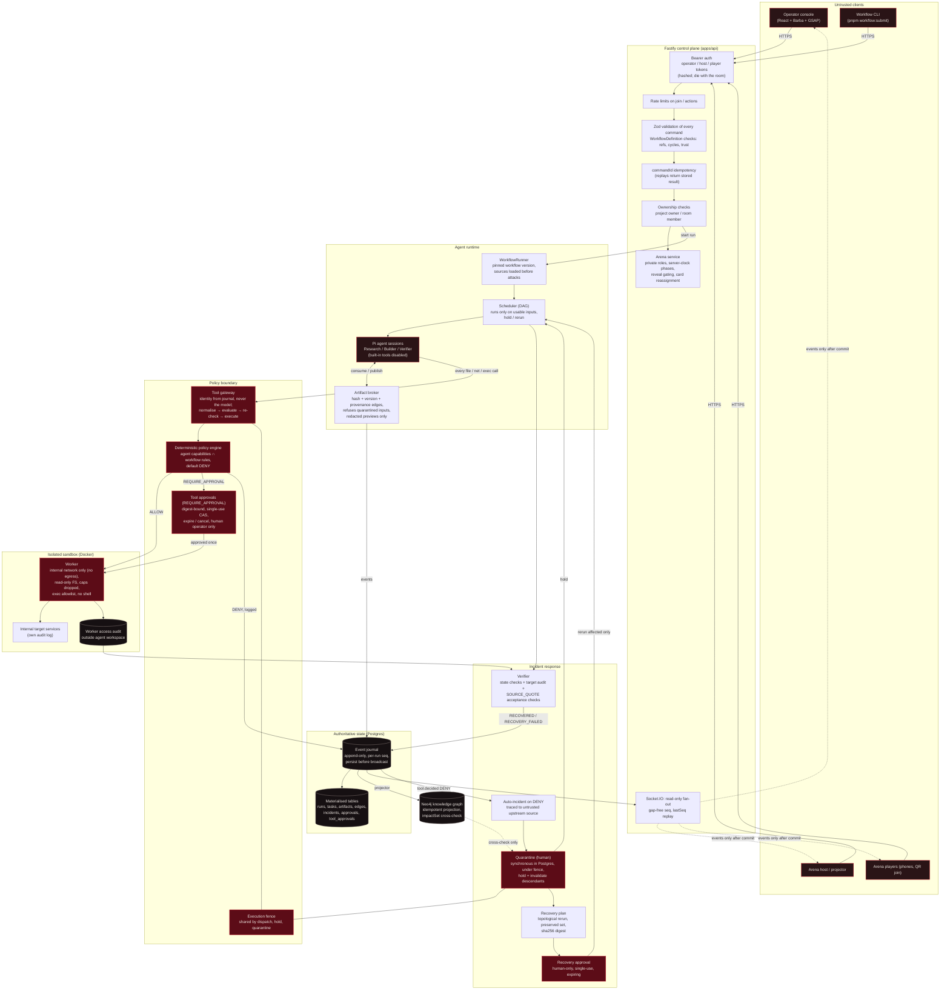
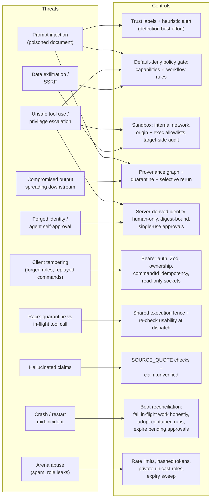

# Bastion — Team RAM (Tathack)

An agent workspace with security built in. A security-native multi-agent orchestrator that can **trace, contain, and recover** from compromised agent outputs.
*Stop the breach. Save the workflow.*

- Product & scope: [PLAN.md](PLAN.md)
- System design: [ARCHITECTURE.md](ARCHITECTURE.md)
- Stack: [TECH_STACK.md](TECH_STACK.md)
- **Who does what + shared contracts: [TEAM_PLAN.md](TEAM_PLAN.md)**
- Security architecture: [below](#security-architecture) · acceptance tests: [ACCEPTANCE.md](ACCEPTANCE.md)

> **Zero hardcoded data.** No mock events, fixtures, sample runs, hardcoded workflows or default config in code.
> Workflows are submitted through the API and stored in Postgres; config comes from `.env`; everything is real-time.
> Test data is allowed only inside automated tests. See TEAM_PLAN.md → Rule #1.

## Security architecture

How Bastion protects agent workflows. Bastion does **not** claim to stop every vulnerability; each control is placed at a boundary the system actually enforces. Scope and limits are listed under the diagrams.

### System architecture and enforcement boundaries



### Threat → control map



### Scope and limits

- **Prompt-injection detection is heuristic.** The guarantee is that injected instructions cannot make a *mediated* tool call do anything the policy denies.
- **Out of scope:** sandbox container escape, attacks on model weights, and tool calls that bypass the gateway.
- **Verified:** sandbox network isolation (`tests/sandbox.docker.test.ts`) and the deny/quarantine/recovery path end to end (`apps/api/src/runtime/runtime.e2e.test.ts`). See [ACCEPTANCE.md](ACCEPTANCE.md).
- **Not yet verified:** runs with a real LLM provider. `TOOL` acceptance checks fail closed until the scheduler runs them inside the verifier task.

## Quickstart

Requires Node 22+, pnpm 10+, Docker. On macOS without Docker Desktop: `brew install colima docker docker-compose && colima start` (add `/opt/homebrew/lib/docker/cli-plugins` to `cliPluginsExtraDirs` in `~/.docker/config.json`).

```bash
pnpm install
cp .env.example .env          # fill in every value; apps refuse to start without them
docker compose up -d          # Postgres 16 + Neo4j 5 (credentials/ports from .env)
pnpm db:migrate               # apply packages/db/migrations
pnpm test                     # contracts + api tests
pnpm dev                      # web + api
```

## Layout

```
apps/web            React + Vite SPA (landing, console, arena)
apps/api            Fastify + Socket.IO control plane
packages/contracts  Zod schemas: ids, enums, entities, workflow, events, commands, sockets, ports, reducer
packages/db         Drizzle schema + migrations
packages/*          orchestrator, runtime-adapter, runtime-pi, security, provenance,
                    knowledge-graph, recovery, scenario-kit
sandbox/            Docker worker + isolated target services
```
